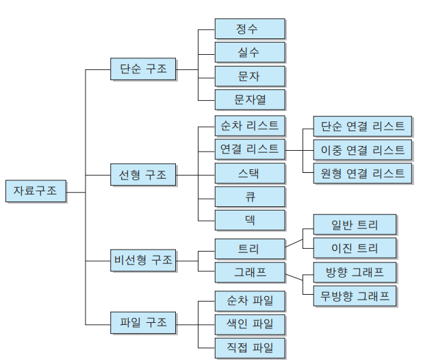

# 자료구조

[참고 블로그 링크](https://davinci-ai.tistory.com/16)

대표적인 자료구조로는 Array, Stack, Queue, Linked List, Hash Table, Heap등이 존재한다. 

Python에서는 대표적으로 List, Tuple, Set, Dictionary가 존재하며,
위의 자료 모두 구현이 가능하다.